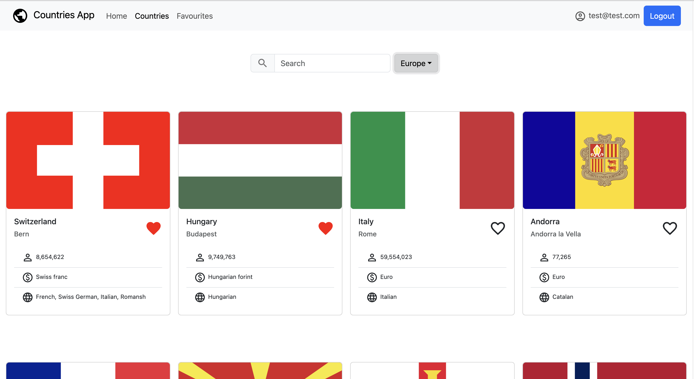

# Countries App

The **Countries App** is a web application that allows users to explore detailed information about different countries, including weather forecasts, news headlines and view country images. It integrates various third-party APIs and Firebase authentication and database for a seamless user experience.

## Features

- **Search and Filter Countries**: Browse a list of countries with options to search by name and filter by region.
- **Country Details**: View detailed information about each country, including population, language, capital, currency and more.
- **Weather Forecast**: Get current weather data in a selected country capital and a 3-day weather forecast using the OpenWeather API.
- **Latest News**: Read the latest news headlines and summaries related to the country, fetched from the News API.
- **Image Gallery**: View pictures of the country fetched from the Unsplash API.
- **Firebase Authentication**: Sign up, log in, and authenticate users with Firebase.

## Technologies Used

- **React**: For building the user interface.
- **React Bootstrap**: For styling and responsive layout.
- **Redux**: For state management.
- **Firebase**: For authentication and hosting.
- **REST Countries API**: For country data.
- **OpenWeather API**: For weather forecasts.
- **News API**: For fetching news articles.
- **Unsplash API**: For fetching images.
- **Currency Converter API**: For currency exchange rates.
- [**React Hot Toast**](https://react-hot-toast.com/docs]): For notifications.
- [**React Scroll-to-Top**](https://www.npmjs.com/package/react-scroll-to-top): For a scroll-to-top component.

## Screenshots





## Getting Started

### Prerequisites

- **Node.js** (version 14 or above)
- **npm or yarn** (for managing packages)
- **API Keys**: You will need API keys for:
  - [Firebase](https://firebase.google.com/)
  - [OpenWeather API](https://openweathermap.org/api)
  - [News API](https://newsapi.org/)
  - [Unsplash API](https://unsplash.com/developers)

### Installation

1. **Clone the repository:**

   ```bash
   git clone https://github.com/alrammahi-mariia/countries-app.git
   cd countries-app
   ```

2. **Install dependencies:**

   ```bash
   npm install
   ```

   or, if you're using yarn:

   ```bash
   yarn install
   ```

3. **Set up the environment variables:**
   Create a `.env` file in the root directory and add your API keys:

   ```
   VITE_FIREBASE_API_KEY=your_firebase_api_key
   VITE_UNSPLASH_API_KEY=your_unsplash_api_key
   VITE_WEATHER_API_KEY=your_openweather_api_key
   VITE_NEWS_API_KEY=your_news_api_key
   ```

4. **Set up Firebase:**

   - Create a Firebase project and enable authentication with email and password.

5. **Run the development server:**

   ```bash
   npm run dev
   ```

   or, if you're using yarn:

   ```bash
   yarn dev
   ```

6. **Open the application in your browser:**
   Navigate to `http://localhost:5173` to view the app.

## Contributing

Contributions are welcome! Please fork the repository, create a new branch, and submit a pull request.

## License

This project is licensed under the MIT License.

## Credits

This project was developed as part of the React Advanced course at Business College Helsinki. A big thank you to our course instructor, [Martin Holland](https://github.com/martin-holland), for the invaluable guidance and support throughout the course!
